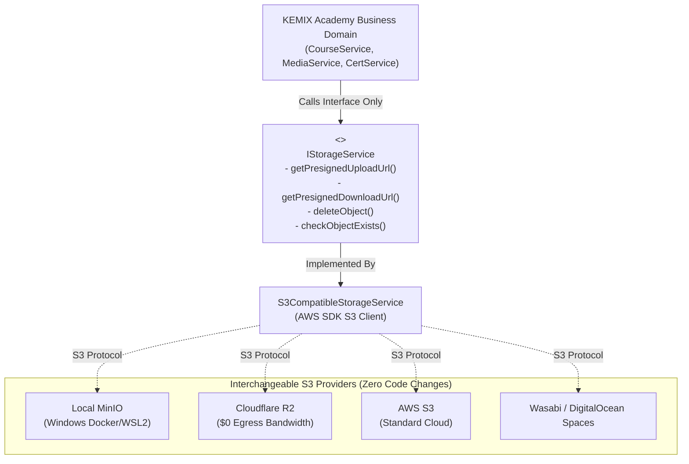
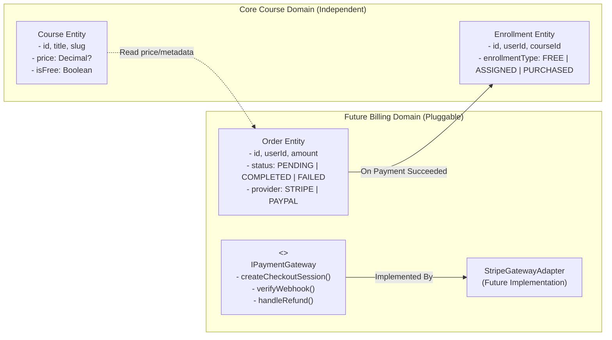

# KEMIX Academy — SYSTEM ARCHITECTURE DOCUMENT

**Project Name:** KEMIX Academy  
**Document Version:** 2.0.0  
**Status:** Architectural Baseline (Pre-Implementation)  
**Author:** Lead Software Architect  
**Target Environment:** Local Windows 10/11 Development (Docker Desktop + WSL2) & Linux Production  

---

## 1. Executive Summary & Architectural Philosophy

**KEMIX Academy** is an enterprise-grade, highly portable Learning Management System (LMS) purpose-built for data analysis education, technical coursework, and student skill certification.

The primary architectural mandate of this project is **Absolute Ownership and Zero Vendor Lock-in**. The entire application, database, file handling, and deployment pipeline must remain 100% portable, hostable on any generic infrastructure, and immune to proprietary AI coding platform runtimes, proprietary BaaS (Backend-as-a-Service) APIs, and single-vendor cloud traps.

### Core Architectural Tenets
1. **Repository Completeness:** Every component required to build, run, migrate, test, and deploy the system exists directly in the Git repository (excluding secrets and production binary data).
2. **Standardized Protocols:** Open standards only — HTTP/HTTPS, REST, PostgreSQL wire protocol, S3-compatible Object Storage API, OAuth/OIDC/Standard Session standards.
3. **Decoupled Data and Object Storage:** Relational data remains strictly normalized in PostgreSQL; large binary media (videos, datasets, PDFs, images) are stored strictly in S3-compliant object storage.
4. **Local Windows Development Parity:** First-class local development on Windows 10/11 using Docker Desktop + WSL2 with seamless cross-platform parity for Linux production environments.
5. **Role-Based Clean Architecture:** Clear separation of concerns between presentation, business domain logic, data access, and infrastructure abstractions.
6. **Independence from AI Tools:** The AI coding tool (Antigravity) is purely a development assistant. KEMIX Academy has zero runtime dependencies on Antigravity and can be built, modified, and deployed completely independently.

---

## 2. FINAL PHASE 1 DECISIONS

Before proceeding to any Phase 2 implementation, the following foundational business and technical architectural decisions are established:

### Decision 1: Monetization Strategy (Phase 2 & MVP Scope)
- **Zero Payment Gateways in Initial MVP:** Online payment processing (Stripe, PayPal, Lemon Squeezy, etc.) will **NOT** be implemented in Phase 2 or the initial MVP.
- **Initial Enrollment Models:**
  1. **Free / Open Enrollment:** Any registered student can enroll in public courses with a single click.
  2. **Admin-Assigned Enrollment:** Administrators and instructors can manually grant or revoke student enrollment.
- **Payment Extensibility Architecture:** The domain model decouples course management from billing. A clean `PaymentGateway` / `BillingService` interface is documented so that a paid checkout workflow can be added in a future phase without modifying the core `Course` or `Enrollment` domain logic.

### Decision 2: Private Video & File Storage Architecture
- **S3 API Abstraction:** KEMIX Academy utilizes private, S3-compatible object storage as its primary media delivery backbone.
- **Provider Support:** The architecture natively supports **Cloudflare R2**, **AWS S3**, and local **MinIO** without code modifications.
- **Zero Cloudflare-Specific API Lock-in:** The application communicates strictly via the universal S3 standard protocol (`@aws-sdk/client-s3`). Cloudflare R2 is utilized purely as an S3-compatible endpoint ($0 egress costs).
- **Time-Limited Signed URLs:** All video lectures, downloadable datasets, and exercise notebooks use short-lived cryptographically signed URLs (15m - 2h expiry) generated on-demand for authorized users.

### Decision 3: Local Development Tooling
- **Primary OS:** Windows 10 / 11 (64-bit).
- **Runtime Virtualization:** Docker Desktop with the WSL2 (Windows Subsystem for Linux) backend.
- **Service Orchestration:** Docker Compose evaluates and orchestrates local infrastructure containers:
  - `postgres:16-alpine`: Local relational database.
  - `minio/minio`: Local S3 object storage simulation.
  - `redis:7-alpine`: Cache and job queue broker.

### Decision 4: Self-Hosted Authentication & Security Lifecycle
- Complete ownership of credentials and user sessions stored directly in PostgreSQL.
- Password hashing via **Argon2id** (RFC 9106).
- Session tokens stored in secure, HttpOnly, SameSite cookies.
- Comprehensive 15-stage authentication lifecycle documented in [SECURITY-ARCHITECTURE.md](file:///e:/KEMIX%20Academy/SECURITY-ARCHITECTURE.md).

### Decision 5: Storage Abstraction Layer (`StorageService`)
- Application business logic interacts solely with an abstract `IStorageService` interface.
- Concrete S3 adapter implements the interface using standard S3 protocol commands (`PutObjectCommand`, `GetObjectCommand`, `DeleteObjectCommand`).
- Switching storage providers requires changing 5 environment variables, with zero application code changes.

### Decision 6: Database & Migration Independence
- Relational database: PostgreSQL 16+.
- Schema, constraints, relations, and migrations strictly managed via Prisma ORM.
- Database can be completely re-created from scratch using `npx prisma migrate deploy` and populated with initial superadmin data using `npm run seed`.

### Decision 7: Absolute Project Ownership & Portability
- Source code is 100% self-contained and pushable to GitHub.
- Zero reliance on proprietary cloud services or AI platform runtimes. KEMIX Academy runs anywhere a standard Node.js process or Docker container can execute.

---

## 3. High-Level System Architecture & Topology

```mermaid
flowchart TB
    subgraph Clients["Client Devices & Browsers"]
        Desktop["Desktop Browsers (Chrome/Edge/Firefox/Safari)"]
        Tablet["Tablets (iPadOS/Android)"]
        Mobile["Mobile Devices (iOS/Android)"]
    end

    subgraph EdgeLayer["Edge / Reverse Proxy / CDN Layer"]
        ReverseProxy["Reverse Proxy (Nginx / Traefik / Caddy) + SSL"]
        PublicCDN["Public Asset CDN (Optional)"]
    end

    subgraph AppServer["Application Layer (KEMIX Academy Core)"]
        WebServer["Web & API Server (Next.js Standalone Node Runtime)"]
        subgraph Subsystems["Modular Core Subsystems"]
            PublicApp["Public Website & Catalog"]
            StudentApp["Student LMS & Learning Engine"]
            AdminApp["Admin CMS & Operations Center"]
            AuthModule["Authentication & RBAC Engine"]
            StorageService["S3 Storage Abstraction Service"]
            CertEngine["PDF & Certificate Generator (pdf-lib)"]
            QuizEngine["Grading & Assessment Engine"]
            PaymentExt["Payment Extensibility Module (Future)"]
        end
    end

    subgraph DataLayer["Persistence & Infrastructure Layer"]
        PostgresDB[("PostgreSQL 16+ Relational DB\n(Primary Schemas & Migrations)")]
        RedisCache[("Redis 7+ (Optional)\n(Rate Limiting, Sessions, Job Queue)")]
        ObjectStore[("S3-Compatible Object Storage\n(Local MinIO / Cloudflare R2 / AWS S3)\n- kemix-academy-public\n- kemix-academy-protected")]
    end

    Clients -->|HTTPS Requests| ReverseProxy
    ReverseProxy -->|Proxy Pass (Port 3000)| WebServer
    WebServer --> Subsystems
    AuthModule --> PostgresDB
    Subsystems --> PostgresDB
    Subsystems --> RedisCache
    StorageService -->|Presigned URLs & Direct S3 API| ObjectStore
    Clients -.->|Direct Upload/Download via Signed URLs| ObjectStore
```

---

## 4. Layered Domain Architecture

The codebase enforces a strict unidirectional dependency flow across four clear architectural tiers:

```
┌─────────────────────────────────────────────────────────────┐
│ 1. PRESENTATION LAYER (UI / UX / Client Components)         │
│    - React Server Components (RSC) & Client Components     │
│    - Tailwind CSS, shadcn/ui Design System, Framer Motion   │
│    - Route Handlers & Server Actions                        │
└──────────────────────────────┬──────────────────────────────┘
                               │
                               ▼
┌─────────────────────────────────────────────────────────────┐
│ 2. APPLICATION / SERVICE LAYER (Business Logic)             │
│    - CourseService, EnrollmentService, QuizService          │
│    - AuthService, CertificateService, MediaService          │
│    - StorageService (S3 Provider Interface)                 │
│    - BillingService (Future Payment Abstraction)            │
└──────────────────────────────┬──────────────────────────────┘
                               │
                               ▼
┌─────────────────────────────────────────────────────────────┐
│ 3. DOMAIN & DATA ACCESS LAYER (Models & Repositories)        │
│    - Prisma ORM Data Models & Normalized Schemas            │
│    - Database Repositories & Data Mappers                   │
│    - Domain Types, Invariants, and Enums                    │
└──────────────────────────────┬──────────────────────────────┘
                               │
                               ▼
┌─────────────────────────────────────────────────────────────┐
│ 4. INFRASTRUCTURE & EXTERNAL ADAPTERS                       │
│    - PostgreSQL Driver & Connection Pooling                 │
│    - S3 Storage Provider (AWS SDK / MinIO Adapter)          │
│    - Email Dispatcher Adapter (SMTP / Console Logger)       │
│    - Cryptographic Engine (Node.js Crypto / Argon2id)       │
└─────────────────────────────────────────────────────────────┘
```

---

## 5. Storage Service Abstraction Model

To prevent any direct coupling between business logic and specific storage vendors, all file operations must pass through the `IStorageService` abstraction:



---

## 6. Payment Extensibility Architecture (Future Integration Blueprint)

Although online payments are excluded from the initial MVP, the architecture guarantees seamless future extensibility without refactoring the Course or Enrollment domains:



- In the MVP: Enrollments are created directly via `EnrollmentService.enrollFree(userId, courseId)` or `EnrollmentService.assignByAdmin(adminId, studentId, courseId)`.
- In Future Monetization: An `OrderService` will invoke `IPaymentGateway.createCheckoutSession()`. Upon webhook confirmation, it calls `EnrollmentService.createEnrollment(userId, courseId, 'PURCHASED')`.

---

## 7. PORTABILITY AND OWNERSHIP AUDIT

This section provides an uncompromised, definitive audit of the platform's independence, answering every operational question regarding infrastructure ownership:

### 1. Can the entire source code be stored in GitHub?
**YES.**  
The repository contains 100% of the application code, UI components, API route handlers, business services, database migration scripts, seed utilities, environment schema configurations, and documentation.

### 2. Can the project run locally on Windows?
**YES.**  
The entire stack runs locally on Windows 10/11 using Docker Desktop with the WSL2 backend for containerized infrastructure (PostgreSQL, MinIO, Redis) and native Node.js LTS for rapid application development.

### 3. Can it run on Linux?
**YES.**  
The production deployment target is Ubuntu 22.04/24.04 LTS or standard Debian/Alpine Linux containers. Node.js runtime and PostgreSQL execute identically across Windows and Linux.

### 4. Can the database be recreated from migrations?
**YES.**  
The database uses standard declarative Prisma / SQL migrations checked into Git under `prisma/migrations/`. A fresh database instance is completely initialized, structured, indexed, and constrained by running `npx prisma migrate deploy` followed by `npm run seed`. No manual database GUI actions are required.

### 5. Can storage be replaced?
**YES.**  
The object storage interface relies strictly on the standard AWS S3 API SDK (`@aws-sdk/client-s3`). To switch between MinIO (local), Cloudflare R2, AWS S3, Wasabi, or DigitalOcean Spaces, you only change five environment variables in `.env` (`S3_ENDPOINT`, `S3_REGION`, `S3_BUCKET`, `S3_ACCESS_KEY_ID`, `S3_SECRET_ACCESS_KEY`). Zero lines of application code need modification.

### 6. Can hosting be replaced?
**YES.**  
The application produces a standard, self-contained standalone Node.js server (`node .next/standalone/server.js`) or a standard OCI-compliant Docker container. It can be hosted on a raw Linux VPS (Hetzner, DigitalOcean, Linode), a managed container platform (AWS ECS, Google Cloud Run, Render, Railway), an open-source PaaS (Coolify, Dokku), or on-premises servers. It is **never** locked to Vercel or any single hosting vendor.

### 7. Can authentication be replaced?
**YES.**  
Authentication uses a self-hosted, decoupled model with password hashing via Argon2id and session/token storage in your own PostgreSQL database. It does not rely on third-party identity providers (such as Clerk, Auth0, or Supabase Auth). You own every user record, password hash, session, and audit trail directly in your own database tables.

### 8. Is any critical functionality dependent on the AI coding platform?
**NO.**  
The AI coding tool (Antigravity) is solely a development assistant. It generates standard TypeScript, HTML, CSS, and SQL. There are no runtime SDKs, background daemons, proprietary telemetry hooks, or cloud proxies linked to the AI vendor. Once written, KEMIX Academy can be edited, built, and deployed completely disconnected from Antigravity.

### 9. Is any critical data stored inside the AI coding platform?
**NO.**  
Zero data, databases, secrets, or media files reside on the AI coding platform. All data is exclusively hosted in your local environment or your chosen independent infrastructure (PostgreSQL and S3).

### 10. What information will NOT be stored in GitHub?
The following items are strictly excluded from GitHub via `.gitignore`:
- Production secrets, cryptographic signing keys, and master passwords (e.g., `DATABASE_URL`, `AUTH_SECRET`, `S3_SECRET_ACCESS_KEY`).
- Actual user-uploaded files, course videos, datasets, and images (stored in S3/MinIO).
- Production database dumps containing user PII or sensitive operational data.
- Local dependency artifacts (`node_modules/`, `.next/`, build caches).

### 11. How will those external resources be recreated?
- **Configuration & Secrets:** Recreated by copying the included `.env.example` template to `.env` and injecting production credentials securely via server environment variables or CI/CD secret managers.
- **Database Schema & Initial Data:** Recreated on any clean PostgreSQL server by executing the automated migration command (`npx prisma migrate deploy`) and database seeder (`npm run seed`), which creates the default administrator account and foundational taxonomy.
- **Storage Infrastructure:** Recreated on any S3-compatible provider by creating two buckets (`kemix-academy-public` and `kemix-academy-protected`) and configuring CORS policies as documented in `DATA-AND-STORAGE-STRATEGY.md`.
