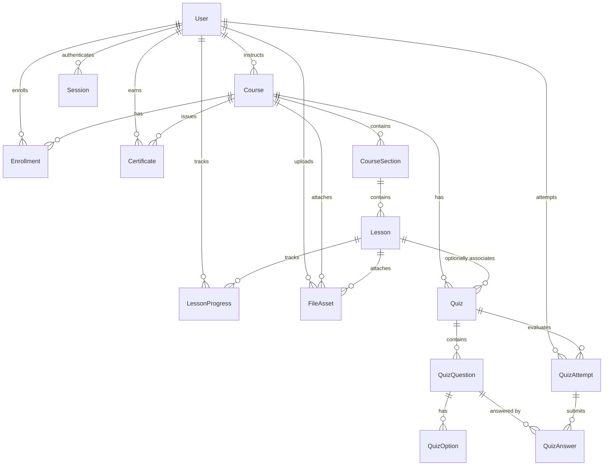

# KEMIX Academy — Core LMS Backend Architecture

## Overview
This document details the backend domain, application, and infrastructure design for the Core Learning Management System (LMS) modules of KEMIX Academy.

---

## 1. Domain Modules & Relational Schema

### Models
1. **Course**: Core learning product (`title`, `slug`, `description`, `status`, `level`, `instructorId`, `durationSeconds`).
2. **CourseSection**: Ordered thematic modules within a course (`title`, `sortOrder`, `courseId`).
3. **Lesson**: Atomic learning unit (`title`, `slug`, `lessonType`: VIDEO/TEXT/FILE/QUIZ, `content`, `storageKey`, `sortOrder`, `isPublished`, `isFreePreview`).
4. **FileAsset**: Tracked media asset (`storageKey`, `originalName`, `mimeType`, `size`, `category`, `visibility`: PUBLIC/PROTECTED).
5. **Enrollment**: Student course participation (`userId`, `courseId`, `status`: ACTIVE/COMPLETED/CANCELLED, `enrollmentType`: FREE_ENROLLMENT/ADMIN_ASSIGNED/PURCHASED).
6. **LessonProgress**: Granular lesson completion tracking (`userId`, `lessonId`, `courseId`, `completed`, `progressPercent`, `lastPositionSeconds`).
7. **Quiz, QuizQuestion, QuizOption, QuizAttempt, QuizAnswer**: Assessment engine with server-side validation and scoring.
8. **Certificate**: Immutable completion credentials with unique `certificateCode` and `verificationToken`.

---

## 2. Enrollment & Access Control Engine

Access rules are centralized inside `CourseAccessService`:
- **ADMIN**: Full management and access to all courses, drafts, sections, lessons, attempts, and progress records.
- **INSTRUCTOR**: Full control over own courses, sections, lessons, quizzes, materials, and student progress within their own courses.
- **STUDENT**:
  - Catalog browsing: Published courses only.
  - Full lesson & file access: Requires active or completed enrollment.
  - Preview lessons: Unenrolled guests and students can access lessons marked `isFreePreview: true` on published courses.
  - Quizzes: Enrolled students only. Correct answers are stripped before submission.
  - Certificates: Unlocked automatically when 100% of published lessons are completed.

---

## 3. Storage & Secure Media Strategy

- **Universal Storage Abstraction (`IStorageService`)**: Interacts with any S3-compatible provider (Cloudflare R2, AWS S3, MinIO) without vendor lock-in.
- **Presigned Uploads (`/api/files/upload-intent`)**: Clients receive short-lived signed PUT URLs for direct-to-bucket uploads.
- **Authorized Download / Streaming (`/api/files/[fileId]/access`)**:
  - `PUBLIC` files return direct CDN URLs.
  - `PROTECTED` files generate short-lived signed GET URLs verified against student enrollment or lesson preview status.

---

## 4. Assessment & Quiz Engine

- **Server-Side Scoring**: The client sends question-option pairs; scoring and pass/fail evaluation happen entirely on the server.
- **Information Isolation**: Correct answer markers (`isCorrect`) and explanations are strictly omitted from student-facing payloads until attempt submission.
- **Attempt Limits**: Enforces `maxAttempts` where configured.

---

## 5. Certificate Verification System

- **Issuance**: Triggered via `/api/certificates` upon verified 100% course completion.
- **Uniqueness**: Cryptographically unique `certificateCode` (e.g. `KEMIX-XXXX-XXXX`) and `verificationToken`.
- **Public Verification (`/api/certificates/verify/[code]`)**: Returns non-sensitive public metadata (recipient name, course title, issuance date, validation status).

---

## 6. Client Agnostic / Android Mobile Compatibility

All API routes (`/api/*`) accept either:
1. `Cookie: session_token=...` (Next.js web browser clients)
2. `Authorization: Bearer <token>` (Mobile apps and third-party API clients)
Both return consistent, typed JSON envelopes conforming to `ApiResponse<T>`.
