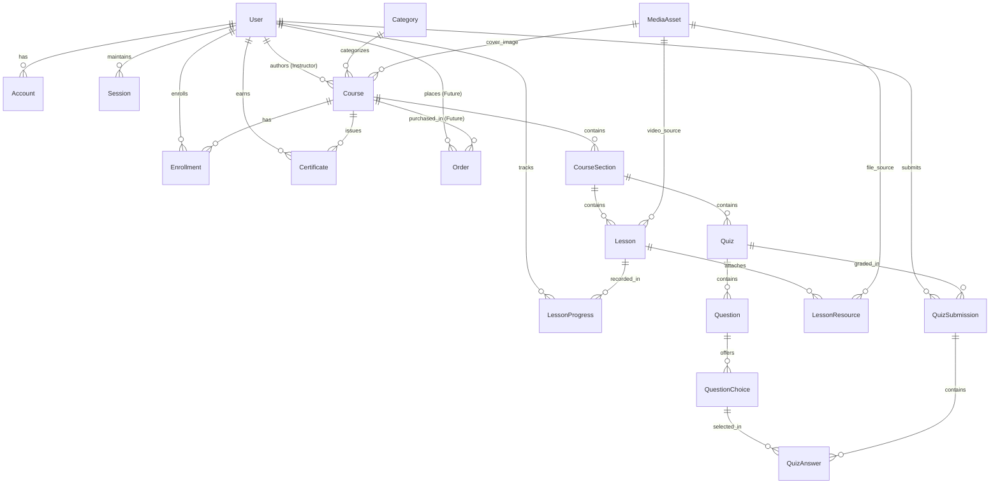
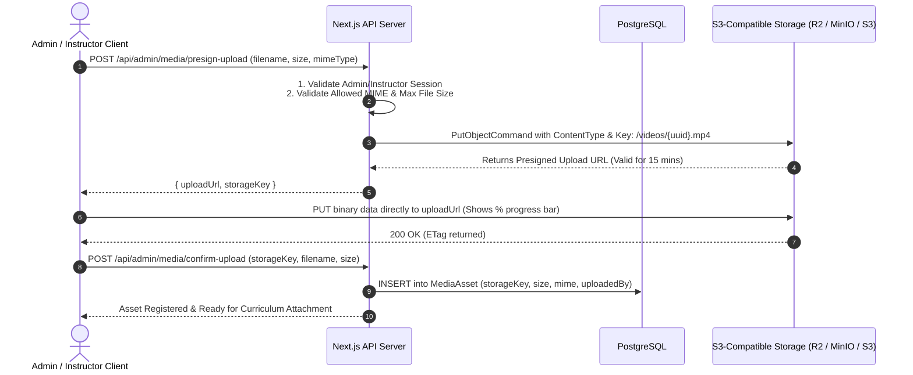

# KEMIX Academy — DATA & STORAGE STRATEGY SPECIFICATION

**Project Name:** KEMIX Academy  
**Document Version:** 2.0.0  
**Status:** Architectural Baseline (Pre-Implementation)  
**Author:** Lead Software Architect  
**Domain:** Database Modeling, Object Storage Abstraction, and Media Streaming Architecture  

---

## 1. Executive Summary & Separation of Concerns

The storage architecture of **KEMIX Academy** enforces a strict, physical boundary between **relational structured data** and **unstructured binary assets**:

```
┌─────────────────────────────────────────────────────────────┐
│                 POSTGRESQL RELATIONAL DB                    │
│   - User identity, credentials, roles                       │
│   - Course metadata, hierarchy, lesson descriptions         │
│   - Enrollment records, progress timestamps                 │
│   - Quiz questions, choices, student submissions            │
│   - File METADATA ONLY (S3 Key, size, mime, checksum)      │
│   - Certificates, verification tokens, system logs          │
│   - Extensible Order/Billing schema placeholders            │
└─────────────────────────────────────────────────────────────┘
                               ▲
                               │ References by Storage Key
                               ▼
┌─────────────────────────────────────────────────────────────┐
│            S3-COMPATIBLE OBJECT STORAGE SERVICE             │
│   - 100% of video files (.mp4, .webm)                      │
│   - 100% of course cover images & avatars (.webp, .png)     │
│   - 100% of dataset practice files (.csv, .xlsx, .parquet)  │
│   - 100% of code scripts & notebooks (.py, .sql, .ipynb)    │
│   - 100% of lecture slides & PDFs (.pdf)                    │
│   - 100% of generated completion certificates (.pdf)        │
└─────────────────────────────────────────────────────────────┘
```

**Golden Rule:** Under zero circumstances are binary files (BLOBs, base64 strings, video streams) stored inside PostgreSQL. Storing media in databases degrades I/O throughput, causes transaction log bloat, destroys query cache efficiency, and makes backups gigabytes larger than necessary.

---

## 2. Storage Service Abstraction Layer (`IStorageService`)

To ensure absolute provider portability, the application domain never interacts directly with Cloudflare R2, AWS S3, or MinIO SDK classes. All media operations pass through the **Storage Service Abstraction**:

```
Application Domain (CourseService, MediaService, CertificateService)
                             ↓
                 <<interface>> IStorageService
                             ↓
              S3CompatibleStorageService (Adapter)
                             ↓
      ┌──────────────────────┼──────────────────────┐
      ▼                      ▼                      ▼
Cloudflare R2             AWS S3               Local MinIO
($0 Egress Bandwidth)   (Standard Cloud)     (Docker/WSL2 Dev)
```

### 2.1. TypeScript Interface Definition

```typescript
// src/server/domain/storage/storage-service.interface.ts

export type BucketType = 'public' | 'protected';

export interface PresignedUploadResult {
  uploadUrl: string;
  storageKey: string;
  expiresInSeconds: number;
}

export interface IStorageService {
  /**
   * Generates a secure, short-lived presigned PUT URL allowing the client
   * to upload a binary file directly to S3 storage.
   */
  getPresignedUploadUrl(params: {
    bucketType: BucketType;
    key: string;
    mimeType: string;
    maxSizeBytes: number;
    expiresInSeconds?: number;
  }): Promise<PresignedUploadResult>;

  /**
   * Generates a time-limited presigned GET URL for streaming protected videos
   * or downloading course resources.
   */
  getPresignedDownloadUrl(params: {
    bucketType: BucketType;
    key: string;
    expiresInSeconds?: number;
    downloadFilename?: string;
  }): Promise<string>;

  /**
   * Deletes an object permanently from storage.
   */
  deleteObject(params: {
    bucketType: BucketType;
    key: string;
  }): Promise<void>;

  /**
   * Verifies whether an object exists in storage.
   */
  checkObjectExists(params: {
    bucketType: BucketType;
    key: string;
  }): Promise<boolean>;

  /**
   * Resolves the public CDN/S3 URL for public assets (avatars, thumbnails).
   */
  getPublicUrl(key: string): string;
}
```

### 2.2. Provider Switching (Zero Code Changes)
Because the implementation communicates strictly via standard S3 commands (`PutObjectCommand`, `GetObjectCommand`, `DeleteObjectCommand`), switching storage providers requires modifying only `.env` settings:

```env
# Cloudflare R2 ($0 Egress Bandwidth - Production Recommended)
S3_ENDPOINT="https://<account-id>.r2.cloudflarestorage.com"
S3_REGION="auto"
S3_PUBLIC_BUCKET="kemix-academy-public"
S3_PROTECTED_BUCKET="kemix-academy-protected"
S3_ACCESS_KEY_ID="xxx"
S3_SECRET_ACCESS_KEY="yyy"
S3_FORCE_PATH_STYLE="false"
```

---

## 3. Relational Database Schema Design (PostgreSQL 16+)

### 3.1. Entity Relationship Diagram (ERD)



---

### 3.2. Detailed Schema Definitions

#### 1. Identity & Access Control
- `User`: Core user record.
  - `id`: UUID (Primary Key)
  - `email`: VARCHAR(255) UNIQUE, NOT NULL
  - `passwordHash`: VARCHAR(255), NOT NULL (Argon2id)
  - `fullName`: VARCHAR(150), NOT NULL
  - `avatarUrl`: VARCHAR(500), NULL
  - `bio`: TEXT, NULL
  - `role`: ENUM (`ADMIN`, `INSTRUCTOR`, `STUDENT`), DEFAULT `STUDENT`
  - `isActive`: BOOLEAN, DEFAULT true
  - `emailVerified`: TIMESTAMPTZ, NULL
  - `failedLoginAttempts`: INT, DEFAULT 0
  - `lockedUntil`: TIMESTAMPTZ, NULL
  - `createdAt`, `updatedAt`: TIMESTAMPTZ, NOT NULL
- `Session`: Active user login sessions.
  - `id`: VARCHAR(255) PRIMARY KEY (Crypto Token Hash)
  - `userId`: UUID, FK -> `User.id` (ON DELETE CASCADE)
  - `expiresAt`: TIMESTAMPTZ, NOT NULL
  - `ipAddress`: VARCHAR(45), NULL
  - `userAgent`: TEXT, NULL
  - `createdAt`: TIMESTAMPTZ, DEFAULT NOW()
- `PasswordResetToken`:
  - `id`: UUID PRIMARY KEY
  - `userId`: UUID, FK -> `User.id` (ON DELETE CASCADE)
  - `tokenHash`: VARCHAR(255) UNIQUE, NOT NULL
  - `expiresAt`: TIMESTAMPTZ, NOT NULL
  - `usedAt`: TIMESTAMPTZ, NULL
- `EmailVerificationToken`:
  - `id`: UUID PRIMARY KEY
  - `userId`: UUID, FK -> `User.id` (ON DELETE CASCADE)
  - `tokenHash`: VARCHAR(255) UNIQUE, NOT NULL
  - `expiresAt`: TIMESTAMPTZ, NOT NULL

#### 2. Course Catalog & Curriculum Hierarchy
- `Category`:
  - `id`: UUID PRIMARY KEY
  - `name`: VARCHAR(100) UNIQUE, NOT NULL
  - `slug`: VARCHAR(100) UNIQUE, NOT NULL
  - `description`: TEXT, NULL
  - `displayOrder`: INT, DEFAULT 0
- `Course`:
  - `id`: UUID PRIMARY KEY
  - `title`: VARCHAR(255), NOT NULL
  - `slug`: VARCHAR(255) UNIQUE, NOT NULL
  - `subtitle`: VARCHAR(500), NULL
  - `description`: TEXT, NOT NULL (Markdown/HTML)
  - `coverImageKey`: VARCHAR(500), NULL (S3 storage key)
  - `previewVideoKey`: VARCHAR(500), NULL (S3 storage key)
  - `categoryId`: UUID, FK -> `Category.id` (ON DELETE RESTRICT)
  - `instructorId`: UUID, FK -> `User.id` (ON DELETE RESTRICT)
  - `level`: ENUM (`BEGINNER`, `INTERMEDIATE`, `ADVANCED`, `ALL_LEVELS`)
  - `status`: ENUM (`DRAFT`, `PUBLISHED`, `ARCHIVED`), DEFAULT `DRAFT`
  - `isFree`: BOOLEAN, DEFAULT true
  - `price`: DECIMAL(10,2), NULL (Extensibility placeholder for future monetization)
  - `prerequisites`: JSONB, DEFAULT '[]'
  - `learningOutcomes`: JSONB, DEFAULT '[]'
  - `createdAt`, `updatedAt`: TIMESTAMPTZ
- `CourseSection`:
  - `id`: UUID PRIMARY KEY
  - `courseId`: UUID, FK -> `Course.id` (ON DELETE CASCADE)
  - `title`: VARCHAR(255), NOT NULL
  - `sortOrder`: INT, NOT NULL
- `Lesson`:
  - `id`: UUID PRIMARY KEY
  - `sectionId`: UUID, FK -> `CourseSection.id` (ON DELETE CASCADE)
  - `title`: VARCHAR(255), NOT NULL
  - `slug`: VARCHAR(255), NOT NULL
  - `type`: ENUM (`VIDEO`, `ARTICLE`, `QUIZ`), DEFAULT `VIDEO`
  - `content`: TEXT, NULL (Lesson notes or Markdown text)
  - `videoAssetKey`: VARCHAR(500), NULL (S3 storage key)
  - `videoDurationSeconds`: INT, DEFAULT 0
  - `isFreePreview`: BOOLEAN, DEFAULT false
  - `sortOrder`: INT, NOT NULL
- `LessonResource`:
  - `id`: UUID PRIMARY KEY
  - `lessonId`: UUID, FK -> `Lesson.id` (ON DELETE CASCADE)
  - `title`: VARCHAR(255), NOT NULL
  - `fileKey`: VARCHAR(500), NOT NULL (S3 storage key)
  - `fileSizeBytes`: BIGINT, NOT NULL
  - `mimeType`: VARCHAR(100), NOT NULL
  - `extension`: VARCHAR(20), NOT NULL (`csv`, `xlsx`, `ipynb`, `pdf`, etc.)

#### 3. Student Progress & Certifications
- `Enrollment`:
  - `id`: UUID PRIMARY KEY
  - `userId`: UUID, FK -> `User.id` (ON DELETE CASCADE)
  - `courseId`: UUID, FK -> `Course.id` (ON DELETE CASCADE)
  - `enrollmentType`: ENUM (`FREE_ENROLLMENT`, `ADMIN_ASSIGNED`, `PURCHASED`), DEFAULT `FREE_ENROLLMENT`
  - `enrolledAt`: TIMESTAMPTZ, DEFAULT NOW()
  - `completedAt`: TIMESTAMPTZ, NULL
  - `status`: ENUM (`ACTIVE`, `COMPLETED`, `CANCELLED`), DEFAULT `ACTIVE`
  - UNIQUE(`userId`, `courseId`)
- `LessonProgress`:
  - `id`: UUID PRIMARY KEY
  - `userId`: UUID, FK -> `User.id` (ON DELETE CASCADE)
  - `lessonId`: UUID, FK -> `Lesson.id` (ON DELETE CASCADE)
  - `isCompleted`: BOOLEAN, DEFAULT false
  - `lastWatchedSeconds`: INT, DEFAULT 0
  - `completedAt`: TIMESTAMPTZ, NULL
  - `updatedAt`: TIMESTAMPTZ, DEFAULT NOW()
  - UNIQUE(`userId`, `lessonId`)
- `Certificate`:
  - `id`: UUID PRIMARY KEY (Used as Public Verification Code)
  - `certificateNumber`: VARCHAR(50) UNIQUE, NOT NULL (e.g. `KMX-2026-9812A`)
  - `userId`: UUID, FK -> `User.id` (ON DELETE RESTRICT)
  - `courseId`: UUID, FK -> `Course.id` (ON DELETE RESTRICT)
  - `issueDate`: TIMESTAMPTZ, DEFAULT NOW()
  - `pdfStorageKey`: VARCHAR(500), NOT NULL (S3 storage key)
  - `verificationHash`: VARCHAR(128) NOT NULL (SHA-256 integrity hash)
  - UNIQUE(`userId`, `courseId`)

#### 4. Quizzes, Questions & Assessments
- `Quiz`:
  - `id`: UUID PRIMARY KEY
  - `sectionId`: UUID, FK -> `CourseSection.id` (ON DELETE CASCADE)
  - `title`: VARCHAR(255), NOT NULL
  - `description`: TEXT, NULL
  - `passingScorePercent`: INT, DEFAULT 80
  - `timeLimitMinutes`: INT, NULL
  - `maxAttempts`: INT, DEFAULT 3
- `Question`:
  - `id`: UUID PRIMARY KEY
  - `quizId`: UUID, FK -> `Quiz.id` (ON DELETE CASCADE)
  - `questionText`: TEXT, NOT NULL
  - `type`: ENUM (`SINGLE_CHOICE`, `MULTIPLE_CHOICE`, `TRUE_FALSE`)
  - `explanation`: TEXT, NULL (Shown after grading)
  - `sortOrder`: INT, NOT NULL
- `QuestionChoice`:
  - `id`: UUID PRIMARY KEY
  - `questionId`: UUID, FK -> `Question.id` (ON DELETE CASCADE)
  - `choiceText`: TEXT, NOT NULL
  - `isCorrect`: BOOLEAN, NOT NULL
  - `sortOrder`: INT, NOT NULL
- `QuizSubmission`:
  - `id`: UUID PRIMARY KEY
  - `quizId`: UUID, FK -> `Quiz.id` (ON DELETE CASCADE)
  - `userId`: UUID, FK -> `User.id` (ON DELETE CASCADE)
  - `scorePercent`: DECIMAL(5,2), NOT NULL
  - `isPassed`: BOOLEAN, NOT NULL
  - `submittedAt`: TIMESTAMPTZ, DEFAULT NOW()

#### 5. Future Payment Extensibility Schema Placeholders
```prisma
// Future Monetization Schema (Excluded from MVP execution, documented for extensibility)
enum OrderStatus {
  PENDING
  COMPLETED
  FAILED
  REFUNDED
}

model Order {
  id              String       @id @default(uuid())
  userId          String
  courseId        String
  amount          Decimal      @db.Decimal(10, 2)
  currency        String       @default("USD")
  status          OrderStatus  @default(PENDING)
  paymentProvider String?      // e.g., "STRIPE", "PAYPAL"
  providerTxId    String?      @unique
  createdAt       DateTime     @default(now())
  updatedAt       DateTime     @updatedAt

  user            User         @relation(fields: [userId], references: [id])
  course          Course       @relation(fields: [courseId], references: [id])
}
```

---

## 4. Object Storage Architecture & Bucket Topology

The storage layer establishes two distinct S3 buckets to guarantee data security:

```
┌────────────────────────────────────────────────────────────────────────┐
│ BUCKET 1: PUBLIC BUCKET (`kemix-academy-public`)                       │
│ Access: Public Read (via CDN / Direct S3 URL)                          │
│ Contents:                                                              │
│  - `/covers/*`       Course cover cards and banners                    │
│  - `/avatars/*`      User and instructor profile photos                │
│  - `/marketing/*`    Public landing page illustrations                 │
└────────────────────────────────────────────────────────────────────────┘

┌────────────────────────────────────────────────────────────────────────┐
│ BUCKET 2: PROTECTED BUCKET (`kemix-academy-protected`)                 │
│ Access: Strictly Private (Zero Public Read Access)                     │
│ Delivery: Short-Lived Signed Presigned URLs Only (15m - 2h expiry)     │
│ Contents:                                                              │
│  - `/videos/*`       Full-length lesson video lectures (.mp4, .webm)   │
│  - `/resources/*`    Datasets (.csv, .xlsx), code (.ipynb, .py, .sql)  │
│  - `/documents/*`    Lecture notes & slide decks (.pdf)                │
│  - `/certificates/*` Official student completion certificates (.pdf)   │
└────────────────────────────────────────────────────────────────────────┘
```

---

## 5. Direct-to-Storage Upload Pipeline (Presigned URLs)



---

## 6. Secure Media Access & Streaming Strategy

Protected educational content (paid videos, proprietary datasets) must never have public URLs. 

### Secure Streaming & Download Flow:
1. When a student opens a lesson player, the client requests the media stream URL:
   `GET /api/courses/{courseId}/lessons/{lessonId}/stream`
2. **Server Verification:**
   - Verifies the user is authenticated.
   - Verifies the user has an active `Enrollment` for this course (or is an Admin/Instructor).
   - If the lesson has `isFreePreview: true`, permits un-enrolled authenticated access.
3. **Presigned URL Generation:**
   The server generates a signed `GetObjectCommand` URL with a **2-hour time-to-live (TTL)**.
4. The client's custom HTML5 video player streams video segments directly from S3/R2 using standard HTTP range requests (byte-range seeking supported natively).
5. Once expired, the URL becomes invalid. Copying and sharing the URL will fail for unauthorized third parties.

---

## 7. Backup, Restore & Disaster Recovery Procedures

### 7.1. Relational Database Backups (PostgreSQL)
- **Automated Daily Snapshot (`pg_dump`):**
  ```bash
  pg_dump -Fc -h $DB_HOST -U $DB_USER $DB_NAME > /backups/kemix_backup_$(date +%F).dump
  ```
- **Point-in-Time Restore Test:**
  ```bash
  pg_restore -c -h $NEW_DB_HOST -U $NEW_DB_USER -d $NEW_DB_NAME /backups/kemix_backup_2026-09-19.dump
  ```

### 7.2. Object Storage Disaster Recovery
- **Bucket Versioning:** Enabled on the protected bucket to protect against accidental deletions or overwrites.
- **Cross-Region Replication:** In production, Cloudflare R2 automatically distributes data globally, or S3 cross-region replication can mirror assets to a secondary backup bucket.
