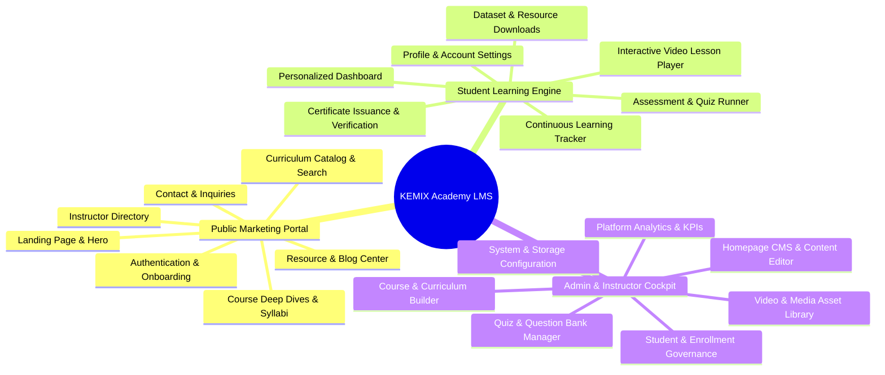

# KEMIX Academy — PROJECT REQUIREMENTS & FUNCTIONAL SPECIFICATION

**Project Name:** KEMIX Academy  
**Document Version:** 2.0.0  
**Status:** Architectural Baseline (Pre-Implementation)  
**Author:** Lead Software Architect  
**Domain:** Professional Data Analysis & Technical Skills Education  

---

## 1. Product Vision & Target Audience

### 1.1. Product Vision
**KEMIX Academy** is an elite, modern educational platform specifically tailored for technical education in **Data Analysis, Business Intelligence, Python/R Data Science, SQL Analytics, Excel Modeling, and Data Engineering**.

Unlike generic LMS platforms, KEMIX Academy is designed around the rigorous pedagogical demands of technical data practitioners:
- Real-world downloadable datasets (CSV, Excel, JSON, Parquet).
- Jupyter Notebook (`.ipynb`) and SQL script resource delivery.
- Step-by-step video lessons accompanied by code walk-throughs.
- Knowledge verification quizzes focusing on analytical reasoning, query comprehension, and formula interpretation.
- Verifiable, cryptographically signed Certificates of Completion for student portfolios and LinkedIn sharing.

### 1.2. Monetization & Enrollment Scope (Phase 2 & MVP)
In alignment with the **Final Phase 1 Decisions**:
- **Zero Online Payment Gateways:** Phase 2 and the initial MVP will **NOT** implement online payment providers (no Stripe, PayPal, Lemon Squeezy, etc.).
- **Supported Enrollment Modes:**
  1. **Free / Open Enrollment:** Authenticated students can enroll in available courses with a single click.
  2. **Admin-Assigned Enrollment:** Administrators can manually grant, review, and revoke student course access.
- **Payment Extensibility:** The architecture establishes clean domain boundaries so that paid checkout sessions, orders, and payment webhooks can be introduced in a future phase without modifying the core `Course` or `Enrollment` domain models.

### 1.3. Key User Personas
1. **The Prospective Student (Guest):** Explores course curricula, previews intro lessons, reviews instructor credentials, and creates an account.
2. **The Enrolled Student:** Consumes video lessons, downloads practice datasets, tracks lesson-by-lesson progress, completes quizzes, and earns completion certificates.
3. **The Instructor:** Authors courses, organizes modules and lessons, attaches data files and practice resources, writes quizzes, reviews student quiz results, and monitors learner engagement.
4. **The Platform Administrator:** Exercises total governance over platform users, course publishing states, media storage assets, site branding, homepage CMS sections, and operational settings.

---

## 2. Functional Requirements Specification

---

### 2.1. Module 1: Public Website & Marketing Portal

#### PR-PUB-01: Homepage & Dynamic Hero
- Compelling hero section with tagline, call-to-action (CTA) buttons, social proof statistics (number of students, courses, completion rate).
- Featured course carousel/grid showcasing top-rated courses.
- "Why Learn with KEMIX Academy" value proposition highlights (practical datasets, industry-ready skills, certified credentials).
- Dynamic testimonial and student outcome showcase.
- Responsive navigation header with active page indicator, theme-ready layout, and quick auth access.
- Footer with categorized links, social channels, copyright, and legal disclaimers.

#### PR-PUB-02: Course Catalog & Discovery
- Full catalog view with server-side pagination and URL-synced search.
- Multi-facet filtering:
  - **Category / Topic:** e.g., SQL, Python, Power BI, Tableau, Excel, Data Modeling, Machine Learning Basics.
  - **Skill Level:** Beginner, Intermediate, Advanced, All Levels.
  - **Duration:** Short (< 3 hours), Medium (3-10 hours), Comprehensive (10+ hours).
  - **Sort By:** Newest, Popular, Highest Rated, Alphabetical.
- Real-time instant search input with debouncing.

#### PR-PUB-03: Course Details & Syllabus Showcase
- Course hero with title, subtitle, category badge, difficulty level, last updated timestamp, instructor avatar, and total video hours.
- Video preview player for introductory/teaser lesson.
- What You'll Learn bulleted learning outcomes.
- Interactive curriculum accordion showing sections, lessons, video durations, and previewable lessons.
- Course prerequisites and required software (e.g., Python 3.11, PostgreSQL, Power BI Desktop).
- Instructor bio card with background, experience, and published courses.
- Prominent enrollment CTA bar (Free / Open Enrollment) with mobile sticky footer support.

#### PR-PUB-04: About Us, Methodology & Instructors
- Academy mission, educational philosophy, and pedagogical approach to practical data analysis.
- Instructor directory with biographical summaries, technical specialties, and active course counts.

#### PR-PUB-05: Educational Blog & Resource Hub
- Public articles, data analysis tutorials, cheat sheets, and industry career guides.
- Categorized by topic with estimated read time, publish date, author, and Markdown-rendered content.

#### PR-PUB-06: Contact & Inquiries
- Secure contact form with CSRF validation, email/message inputs, and server-side rate limiting.
- Automated notification logging or email dispatch to administrators.

#### PR-PUB-07: Public Certificate Verification Portal (`/verify/{certificateId}`)
- Publicly accessible, unauthenticated verification endpoint.
- Displays official student name, course title, completion date, instructor name, and authenticity verification badge.
- Open Graph meta tags optimized for LinkedIn sharing and social embeds.

---

### 2.2. Module 2: Student Learning Platform

#### PR-STU-01: Authentication & Onboarding
- Secure user registration with email, full name, and strong password validation.
- Secure login with email/password and "Remember Me" option via persistent session tokens.
- Secure password reset workflow with time-expiring cryptographic tokens.
- Profile management: Update full name (used on certificates), bio, avatar upload, and password change.

#### PR-STU-02: Student Dashboard
- Overview of active enrollments with visual progress bars (e.g., "75% completed").
- "Continue Learning" quick-resume card jumping directly to the last viewed lesson.
- Completed courses section with one-click certificate downloads.
- Personal learning statistics: total lessons finished, quizzes passed, study time logged.

#### PR-STU-03: Unified Course Player
- Two-column responsive layout:
  - Left column (Main): Video player, lesson title, text instructions, and tabbed resources.
  - Right column (Curriculum Drawer): Accordion outline of all sections and lessons, with checkmarks for completed lessons, active lesson highlight, and quiz indicators.
- **Custom Video Player Features:**
  - Playback speed control (0.75x, 1x, 1.25x, 1.5x, 2x).
  - Auto-resume playback from last recorded timestamp.
  - Keyboard shortcuts (Space = Play/Pause, Left/Right = Seek, F = Fullscreen).
  - Automatic "Mark as Complete" trigger upon reaching 90% video playback.
  - Next Lesson / Previous Lesson navigation buttons.

#### PR-STU-04: Dataset & File Resource Center
- Tabbed resource drawer within each lesson for attached files.
- Supported file types: `.csv`, `.xlsx`, `.xls`, `.json`, `.parquet`, `.sql`, `.py`, `.ipynb`, `.pdf`, `.zip`.
- Download links generated as secure, time-expiring signed S3 URLs.
- File size and format indicators displayed alongside download buttons.

#### PR-STU-05: Assessment & Quiz System
- Quizzes embedded seamlessly into course sections.
- Question formats: Single Choice (Radio), Multiple Choice (Checkboxes), True/False.
- Interactive question navigation with visual status (Answered, Unanswered, Current).
- Immediate client-side and server-side grading upon submission.
- Detailed quiz results review screen:
  - Score percentage, passing score threshold, pass/fail status.
  - Question-by-question review with explanations of correct answers.
  - Retry mechanism if passing threshold was not met (configurable attempt limits).

#### PR-STU-06: Certificate Generation & Download
- Automated trigger: Triggered when 100% of course lessons are marked complete AND all required quizzes are passed.
- High-resolution, vector-quality PDF generation via `pdf-lib`.
- Includes verified credential ID, issue date, student full name, course title, and QR code linked to public verification URL.
- Available for direct in-browser viewing and PDF download from the student dashboard.

---

### 2.3. Module 3: Administration & Operations Cockpit

#### PR-ADM-01: Admin Authentication & RBAC Governance
- Multi-tier role-based access control: `ADMIN`, `INSTRUCTOR`, `STUDENT`.
- Dedicated, secure administrative routes (`/admin/*`) shielded by server-side role validation middleware.
- Session timeout and secure logout.

#### PR-ADM-02: Executive Dashboard & Analytics
- Core KPI metrics: Total Active Students, Total Instructors, Active Courses, Total Enrollments, Course Completion Rates.
- Visual charts: Enrollment trends over time, top-performing courses, quiz pass-fail ratios.
- Recent activity feed: New student registrations, course completions, and recently uploaded media.

#### PR-ADM-03: User Management
- Searchable, paginated user directory.
- Filter by role (`ADMIN`, `INSTRUCTOR`, `STUDENT`), account status (Active, Suspended), and registration date.
- Admin capabilities: Change user role, reset password, update profile details, suspend/activate account, inspect and manually assign enrolled courses.

#### PR-ADM-04: Hierarchical Course Builder
- **Course Level:** Create/edit course metadata (title, slug, description, category, level, cover image, preview video, publish status: `DRAFT`, `PUBLISHED`, `ARCHIVED`).
- **Section Level:** Create, rename, delete, and drag-and-drop reorder module sections within a course.
- **Lesson Level:** Create, edit, delete, and drag-and-drop reorder lessons within a section.
  - Lesson types: `VIDEO`, `ARTICLE / TEXT`, `QUIZ`.
  - Content inputs: Rich text editor for lesson notes, video selector/uploader, downloadable resource attachments.
  - Free preview toggle: Allows marking specific intro lessons as publicly accessible without enrollment.

#### PR-ADM-05: Quiz & Assessment Builder
- Create quizzes tied to specific course sections.
- Configure passing threshold percentage (e.g., 80%), time limit (optional), and retake policies.
- Question editor: Add questions, define question text, explanation notes, point weight, and choices with designated correct answers.

#### PR-ADM-06: Media & File Asset Manager
- Unified media browser displaying all uploaded files across buckets.
- Upload files directly from local computer (drag-and-drop or file picker).
- Automatic categorisation: Videos (`/videos`), Images (`/images`), Documents/Datasets (`/resources`).
- Direct-to-storage upload status tracking with visual progress percentage.
- File details view: Storage key, file size, MIME type, upload date, and attached course reference.
- Safe deletion verification: Warns admin if an asset is currently linked to an active lesson.

#### PR-ADM-07: Homepage CMS & Content Editor
- Visual manager for dynamic homepage elements:
  - Hero headline, subtext, and CTA buttons.
  - Featured course selections.
  - Announcement banner text and toggle.
  - Value proposition feature cards.
- Immediate preview and one-click publishing.

#### PR-ADM-08: System Settings & Configurations
- General site name, support email address, social media links.
- Storage configuration health monitor (verifies S3 connection and bucket access).
- Database migration status indicator.

---

## 3. Non-Functional Requirements (NFRs)

### 3.1. Performance & Core Web Vitals
- **Largest Contentful Paint (LCP):** < 2.0s on standard 4G connections for public catalog and landing pages.
- **Cumulative Layout Shift (CLS):** < 0.05 across all viewports.
- **First Input Delay (FID) / INP:** < 100ms.
- **Video Playback Latency:** Initial video buffer start < 1.5s using modern MP4/WebM byte-range streaming via presigned URLs.

### 3.2. Responsive Design & Cross-Device Compatibility
- Flawless responsiveness across Mobile (360px - 767px), Tablet (768px - 1023px), Desktop (1024px - 1920px), and Ultra-wide (1920px+).
- Touch-optimized interfaces on mobile/tablet: Swipe-to-close curriculum drawer, responsive video controls, accessible tap targets (minimum 44x44px).

### 3.3. Accessibility (a11y)
- Target: **WCAG 2.1 Level AA Compliance**.
- High-contrast color ratios for readability in both light and dark modes.
- Full keyboard navigability (Tab order, Enter/Space activation, Esc modal dismiss).
- Screen-reader accessible semantic HTML and ARIA labels for video players and quiz forms.

### 3.4. Security, Privacy & Data Protection
- Zero plain-text passwords; Argon2id password hashing.
- Encrypted HTTP-only, SameSite cookies for session management.
- All file downloads for paid/protected courses protected by time-expiring cryptographically signed S3 URLs.
- Comprehensive input validation using Zod on all client requests and server endpoints.
- Rate limiting on authentication, contact, and file upload endpoints.

### 3.5. Reliability & Availability
- Application server must be stateless, allowing instant restarts and zero-downtime rolling deploys.
- Automated daily database backups with verified point-in-time restore capability.
- Graceful degradation: If Redis is unavailable, fallback gracefully to direct database queries without taking down the public site.
