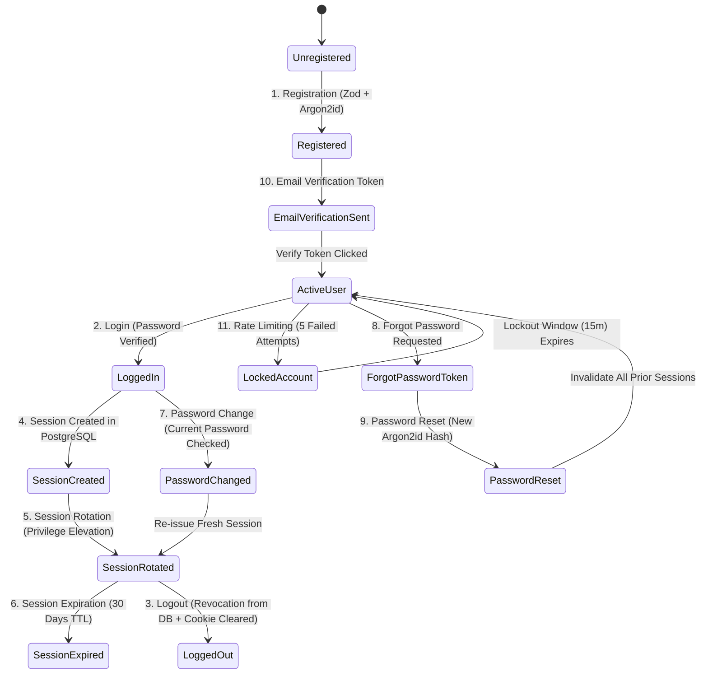

# KEMIX Academy — SECURITY ARCHITECTURE & COMPLETE AUTHENTICATION LIFECYCLE

**Project Name:** KEMIX Academy  
**Document Version:** 2.0.0  
**Status:** Architectural Baseline (Pre-Implementation)  
**Author:** Lead Software Architect  
**Scope:** Application Security, Complete 15-Stage Authentication Lifecycle, RBAC, Storage Hardening, and OWASP Mitigations  

---

## 1. Security Philosophy & Threat Model

**KEMIX Academy** operates on a **Zero-Trust Server-Side Model**:
- The client (browser, mobile device) is considered completely untrusted.
- Client-side validation is strictly for user ergonomics (instant feedback); all authorization, validation, sanitization, and access boundaries are rigorously enforced server-side.
- No sensitive operational logic, private keys, or elevated database credentials are ever exposed to the client.

### Threat Vector Overview & Mitigation Matrix

```
┌───────────────────────────────────────┬─────────────────────────────────────────────────────────┐
│ Threat Vector                         │ Architectural Defense Mechanism                         │
├───────────────────────────────────────┼─────────────────────────────────────────────────────────┤
│ Credential Stuffing & Brute Force    │ Argon2id Hashing + Account Lockout + IP/Email Limiting  │
│ Session Hijacking / Token Theft       │ HttpOnly, SameSite=Lax/Strict, Secure Encrypted Cookies │
│ Session Fixation                      │ Cryptographic Session ID Rotation on State Changes      │
│ Broken Access Control (BOLA/IDOR)     │ Server-Side Service Layer RBAC & Ownership Verification │
│ SQL Injection                         │ Parameterized Queries via Prisma ORM (Zero raw strings) │
│ Cross-Site Scripting (XSS)            │ React Auto-Escaping + Strict Content Security Policy    │
│ Cross-Site Request Forgery (CSRF)     │ SameSite Cookie Enforcement + Origin/Referer Validation │
│ Malicious File Upload Attacks         │ Direct Presigned S3 + MIME Whitelist + UUID Key Renaming│
│ Video / Content Piracy Hotlinking     │ Expiring S3 Signed URLs with Granular Enrollment Checks │
│ Secret Leaks & GitHub Exposure        │ Strict .gitignore + Boot-time Zod Environment Auditing  │
└───────────────────────────────────────┴─────────────────────────────────────────────────────────┘
```

---

## 2. Complete 15-Stage Authentication & Authorization Lifecycle

Below is the definitive, stage-by-stage specification of the KEMIX Academy identity management system.



---

### Stage 1: Registration
1. Client submits `POST /api/auth/register` with `{ email, password, fullName }`.
2. Server validates input using Zod:
   - Email: valid email format, normalized to lowercase, trimmed.
   - Password: minimum 8 characters, at least 1 uppercase letter, 1 lowercase letter, 1 number, and 1 special symbol.
   - Full Name: 2 - 150 characters, trimmed.
3. Server queries PostgreSQL to verify email uniqueness. If the email exists, return a generic success message or handle gracefully to prevent account enumeration.
4. Server hashes password using **Argon2id** (memory: 64MB, iterations: 3, parallelism: 4).
5. User record is inserted with `role = STUDENT`, `isActive = true`, and `emailVerified = null`.

### Stage 2: Login
1. Client submits `POST /api/auth/login` with `{ email, password, rememberMe }`.
2. Server verifies client IP and email against the rate-limiting store (max 5 attempts per 15 minutes).
3. Server retrieves user by email from PostgreSQL. If account is locked (`lockedUntil > NOW()`), return HTTP 423 Locked.
4. If user not found, perform dummy Argon2id hash verification to equalize response timing (mitigating timing attacks) and return HTTP 401 Unauthorized.
5. If user found, verify submitted password against `passwordHash` using Argon2id.
6. **On Failure:** Increment `failedLoginAttempts`. If count reaches 5, set `lockedUntil = NOW() + 15 minutes`. Return HTTP 401.
7. **On Success:** Reset `failedLoginAttempts = 0` and proceed to Stage 4 (Session Creation).

### Stage 3: Logout
1. Client submits `POST /api/auth/logout`.
2. Server reads session token from the `session_token` cookie.
3. Server deletes the corresponding session record from PostgreSQL (`DELETE FROM Session WHERE id = :hashedToken`).
4. Server sets the `session_token` response cookie with `Max-Age = 0`, `Expires = Thu, 01 Jan 1970 00:00:00 GMT`, wiping it from the browser.
5. Returns HTTP 200 OK with redirect instruction to `/login`.

### Stage 4: Session Creation
1. Upon successful login, the server generates a cryptographically random 32-byte session token:
   `const rawToken = crypto.randomBytes(32).toString('base64url');`
2. Computes SHA-256 hash of the token: `const tokenHash = crypto.createHash('sha256').update(rawToken).digest('hex');`
3. Persists session in PostgreSQL:
   - `id`: `tokenHash`
   - `userId`: `user.id`
   - `expiresAt`: `NOW() + (rememberMe ? 30 days : 24 hours)`
   - `ipAddress`: Request IP
   - `userAgent`: Request User-Agent header
4. Transmits `rawToken` to client via HTTP Response Header:
   `Set-Cookie: session_token=<rawToken>; Path=/; HttpOnly; Secure; SameSite=Lax; Max-Age=<seconds>`

### Stage 5: Session Rotation
To eliminate **Session Fixation** vulnerabilities:
1. Whenever a user's security state changes (e.g., successful login, role elevation, password change, or explicit re-authentication), the existing session ID is revoked in the database.
2. A completely new session token is generated, persisted in PostgreSQL, and issued via `Set-Cookie`.
3. The client never retains an old session token across privilege boundaries.

### Stage 6: Session Expiration & Invalidation
1. Every authenticated request checks `Session.expiresAt > NOW()`.
2. If expired:
   - The session row is purged from PostgreSQL.
   - The response cookie is cleared.
   - Request is redirected to `/login?error=session_expired`.
3. Background cleanup job (or cron) purges expired sessions daily: `DELETE FROM Session WHERE expiresAt < NOW()`.

### Stage 7: Password Change (Authenticated)
1. Authenticated user submits `POST /api/auth/change-password` with `{ currentPassword, newPassword }`.
2. Server verifies `currentPassword` against `user.passwordHash` using Argon2id.
3. Server validates `newPassword` against complexity rules and ensures it differs from `currentPassword`.
4. Updates `passwordHash` in PostgreSQL with freshly computed Argon2id hash.
5. Rotates session token (Stage 5) or revokes all other active sessions for that user:
   `DELETE FROM Session WHERE userId = :userId AND id != :currentSessionHash`.

### Stage 8: Forgot Password (Unauthenticated)
1. User submits `POST /api/auth/forgot-password` with `{ email }`.
2. Rate-limited to max 3 requests per hour per IP/email.
3. If user exists:
   - Server generates a 32-byte random reset token.
   - Computes SHA-256 hash and saves into `PasswordResetToken` table (`expiresAt = NOW() + 15 minutes`).
   - Dispatches email containing link: `https://kemix.academy/reset-password?token=<rawToken>`.
4. Server always returns generic HTTP 200: "If an account with that email exists, password reset instructions have been sent." (Prevents account discovery).

### Stage 9: Password Reset (Verification & Execution)
1. User opens reset link in browser and submits `{ token, newPassword }`.
2. Server computes `SHA-256(token)` and checks `PasswordResetToken` where `tokenHash = :hash AND expiresAt > NOW() AND usedAt IS NULL`.
3. If token invalid or expired: Return HTTP 400 with error message.
4. If valid:
   - Computes new Argon2id hash for `newPassword`.
   - Updates `User.passwordHash`.
   - Sets `PasswordResetToken.usedAt = NOW()`.
   - Revokes **all** existing sessions for that user (`DELETE FROM Session WHERE userId = :userId`).
   - Returns success response prompting login.

### Stage 10: Email Verification
1. Upon registration, an `EmailVerificationToken` is generated (valid for 24 hours).
2. Verification link dispatched to student's email.
3. On clicking `GET /api/auth/verify-email?token=<rawToken>`:
   - Server validates token hash and expiration.
   - Sets `User.emailVerified = NOW()`.
   - Deletes the verification token.
   - Redirects to `/dashboard?verified=true`.

### Stage 11: Account Lockout & Rate Limiting Strategy
- **Brute Force Protection:** Tracks failed consecutive attempts per user record (`failedLoginAttempts`).
- **Trigger:** If `failedLoginAttempts >= 5`, set `lockedUntil = NOW() + 15 minutes`.
- **IP-Level Rate Limiting:** Managed via in-memory or Redis sliding window limiter:
  - `/api/auth/login`: 5 attempts / 15 minutes per IP.
  - `/api/auth/register`: 3 attempts / hour per IP.
  - `/api/auth/forgot-password`: 3 attempts / hour per IP.

### Stage 12: Admin Authorization
- Protected administrative endpoints (`/admin/*`, `/api/admin/*`) require:
  1. Valid, active session.
  2. `user.role === 'ADMIN'`.
  3. `user.isActive === true`.
- If a non-admin attempts access, server immediately responds with HTTP 403 Forbidden and logs a security audit event.

### Stage 13: Instructor Authorization
- Instructors require `user.role === 'INSTRUCTOR' || user.role === 'ADMIN'`.
- **Object-Level Authorization:** When modifying a course or lesson:
  ```typescript
  if (user.role !== 'ADMIN' && course.instructorId !== user.id) {
    throw new ForbiddenException("Unauthorized: You are not the author of this course.");
  }
  ```

### Stage 14: Student Authorization
- Enrolled curriculum access requires:
  1. Valid, active session.
  2. `user.isActive === true`.
  3. Active `Enrollment` record for the requested `courseId` (unless the specific lesson has `isFreePreview === true`).

### Stage 15: CSRF Protection Strategy
- **SameSite Cookie Standard:** Session cookies are configured with `SameSite=Lax` (or `SameSite=Strict` for administrative mutations). Browsers automatically withhold cookies on cross-origin POST requests.
- **Origin & Referer Header Verification:** For all state-modifying requests (`POST`, `PUT`, `DELETE`, `PATCH`), the server verifies that the `Origin` or `Referer` header matches `APP_URL`.
- **Custom Request Header Defense:** API routes invoked by client-side fetches include custom headers (e.g., `X-Requested-With: XMLHttpRequest` or `Sec-Fetch-Site: same-origin`), which cannot be forged cross-origin without triggering a preflight CORS block.

---

## 3. Password Hashing Specification (Argon2id)

- **Algorithm:** **Argon2id** (RFC 9106, default OWASP recommendation).
- **Parameters:**
  - Memory: 64 MB (65,536 KiB)
  - Iterations: 3
  - Parallelism: 4 threads
  - Salt: 16 cryptographically random bytes (`crypto.randomBytes(16)`)
- **PHC String Output:** `$argon2id$v=19$m=65536,t=3,p=4$...`

---

## 4. Secure File Upload & Media Protection

### 4.1. File Upload Safeguards
1. **Direct-to-S3 Presigned Uploads:** The application server never writes uploaded files to its local disk. Files stream directly to isolated S3 storage buckets, eliminating disk exhaustion and local executable execution vectors.
2. **Strict MIME-Type and Extension Whitelisting:**

| Category | Allowed Extensions | Allowed MIME Types | Max Size |
| :--- | :--- | :--- | :--- |
| **Course Videos** | `.mp4`, `.webm` | `video/mp4`, `video/webm` | 1 GB |
| **Images & Covers** | `.webp`, `.jpg`, `.png` | `image/webp`, `image/jpeg`, `image/png` | 5 MB |
| **Data Analysis Files** | `.csv`, `.xlsx`, `.parquet`, `.json` | `text/csv`, `application/vnd.openxmlformats...`, `application/json` | 50 MB |
| **Code & Notebooks** | `.py`, `.sql`, `.ipynb` | `text/x-python`, `application/sql`, `application/x-ipynb+json` | 10 MB |
| **Lecture PDFs** | `.pdf` | `application/pdf` | 25 MB |

3. **Prevention of SVG-Based XSS:** SVG uploads are strictly prohibited for user avatars and course covers due to embedded `<script>` execution vectors. Only raster formats (`.webp`, `.jpg`, `.png`) are accepted.
4. **UUID File Key Renaming:** Original client filenames are stripped before storage. Files are stored using cryptographic UUIDs:
   `/videos/c6b3e944-a901-447b-8321-4f1e5828c29b.mp4`
   This eliminates Directory Traversal attacks (`../../etc/passwd`).

### 4.2. Video & Course Asset Piracy Defenses
- Paid video lessons and dataset files are stored in the **Protected S3 Bucket** with zero public access.
- Temporary playback URLs are signed using HMAC-SHA256 with an expiration window of 2 hours.
- Download links for practice datasets expire in 15 minutes.
- Byte-range HTTP requests are passed through signed headers, enabling fluid video seeking while preventing permanent URL sharing.

---

## 5. HTTP Security Headers & Network Hardening

The application reverse proxy (Nginx) and Next.js configuration enforce enterprise-grade security headers:

```nginx
# Secure HTTP Response Headers Configuration
add_header X-Frame-Options "DENY" always;
add_header X-Content-Type-Options "nosniff" always;
add_header X-XSS-Protection "1; mode=block" always;
add_header Referrer-Policy "strict-origin-when-cross-origin" always;
add_header Permissions-Policy "camera=(), microphone=(), geolocation=()" always;
add_header Strict-Transport-Security "max-age=31536000; includeSubDomains; preload" always;

# Content Security Policy (CSP)
add_header Content-Security-Policy "default-src 'self'; script-src 'self' 'unsafe-inline'; style-src 'self' 'unsafe-inline'; img-src 'self' data: https:; media-src 'self' blob: https:; font-src 'self'; connect-src 'self' https:; frame-ancestors 'none';" always;
```

---

## 6. Secrets Management & Zero-Leakage Guarantee

1. **`.env` Exclusion:** The `.env` file is strictly ignored by `.gitignore`.
2. **Type-Safe Environment Validation:** At application startup, `src/env.ts` parses all environment variables against a Zod schema. If a secret is missing or has default insecure placeholders in production, the application halts immediately with a fatal configuration error.
3. **Zero Hardcoded Fallbacks:** Secret keys have no insecure fallback values (e.g., `process.env.AUTH_SECRET || 'secret'`).
4. **Pre-Commit Secrets Scanning:** Pre-commit hooks verify that no private keys, AWS access secrets, or database URLs exist in staged commits.
